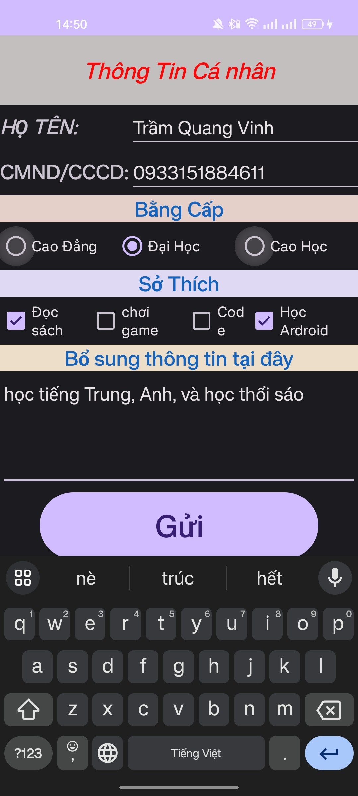
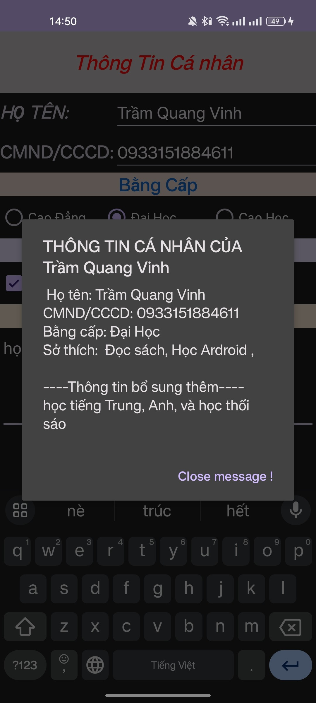
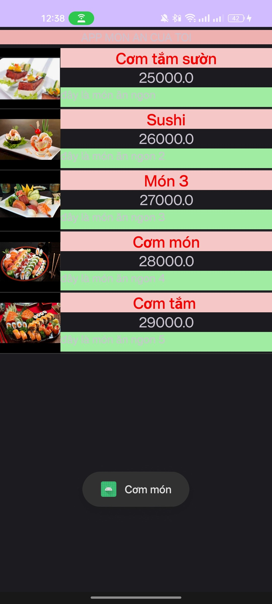
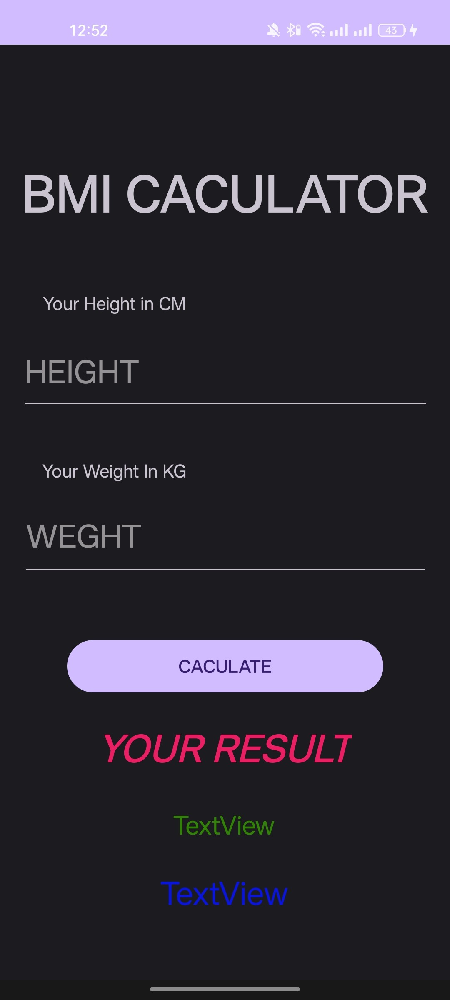
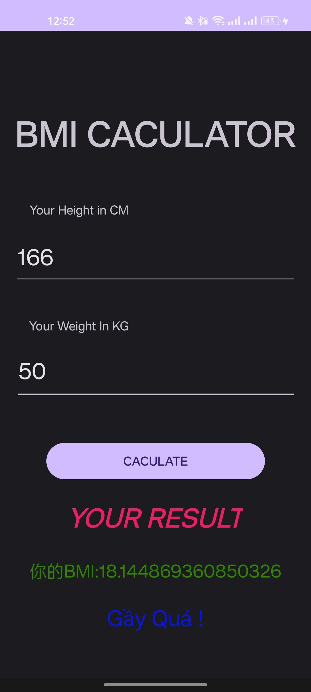
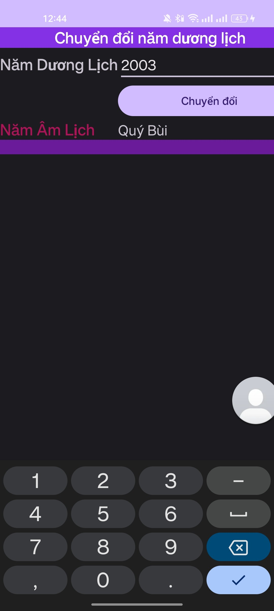
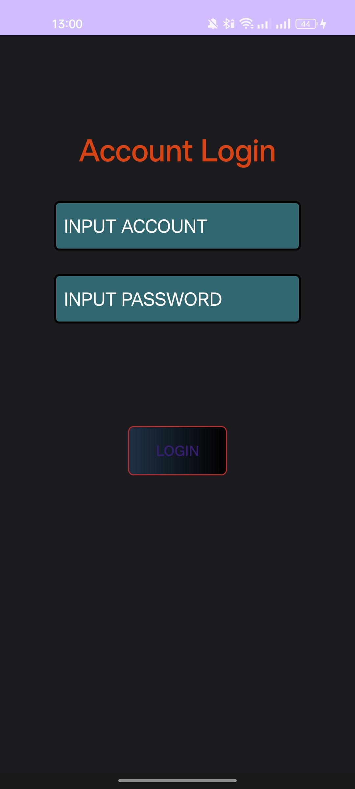
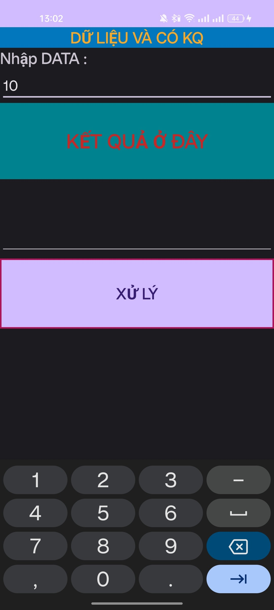
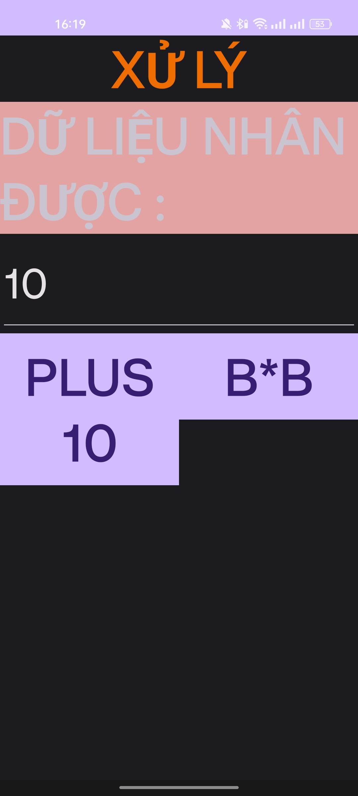

# Vinh63132835_LapTrinh_mobile
Trầm Quang Vinh - 63.CNTTCLC1 - 63132835

@@@@@@@@@@@@@@@@@@@@@@@@@@@@@@@@@@@@@@@@@@@@@@@@@@@@@@@@@@@@@@@@@@@@@@@@@@@@@@@@@@@@@@@@@@@@@@@@@@@@@@@@@@@@@@@@@@@@@@@@@@@@@@@@@@@@@@@@@@@@@@@@@@@@@@@@@@
- (NHỮNG KIẾN THỨC MỚI SẼ UP LÊN ĐÂY) 
- (NHỮNG BÀI TRÊN LỚP HOẶC TƯƠNG TỰ SẼ KHÔNG ĐƯỢC UP LÊN ĐÂY)
------------------------------------------------------------------------------------------------------------------------------------------------------------------------------------
Bài 1: THÔNG TIN NGƯỜI DÙNG

Mức độ: trung bình

Mô tả: xử dụng checkbox, radiobutton, xử lý ràng buộc, dialog để thực hiện bài toán.

Chi tiết: Nhập thông tin vào các dữ liệu trong bài và nhấn nút gửi sẽ hiện dialog.

 

LINK: https://github.com/VinhKaiKai/Vinh63132835_LapTrinh_mobile/tree/main/source/sothich

------------------------------------------------------------------------------------------------------------------------------------------------------------------------------------
Bài 2: MÓN ĂN (ListView)

Mức độ: trung bình - Khó

Mô tả: Dùng lisview có custom lại để thực hiện menu món ăn.

Chi tiết: Chọn vào món ăn hay tiêu đề nó sẽ hiện lên một Toast ngắn.

LINK: https://github.com/VinhKaiKai/Vinh63132835_LapTrinh_mobile/tree/main/source/AppMonAn

------------------------------------------------------------------------------------------------------------------------------------------------------------------------------------
Bài 3: BMI

Mức độ: dễ

Mô tả: xử lý điểm số hiển thị, điều kiện.

Chi tiết: Nhập thông tin vào các dữ liệu cần ấn nút nó sẽ thể hiện tình trạng sức khỏe.

 

LINK: https://github.com/VinhKaiKai/Vinh63132835_LapTrinh_mobile/tree/main/source/IBM

------------------------------------------------------------------------------------------------------------------------------------------------------------------------------------

Bài 4: CHUYỂN ĐỔI DƯƠNG - ÂM LỊCH

Mức độ: dễ

Mô tả: Layout table, xử lý thuật toán.

Chi tiết: Nhập thông tin vào các dữ liệu Dương hoặc âm lịch có thể chuyển đổi vd: 2003 -> Quý mùi.

LINK: https://github.com/VinhKaiKai/Vinh63132835_LapTrinh_mobile/tree/main/source/ChuyenDoiDuongLich

------------------------------------------------------------------------------------------------------------------------------------------------------------------------------------

Bài 5: CUSTOM CÁC ĐỊNH DẠNG (BUTTON, TEXTVIEW)

Mức độ: dễ

Mô tả: thực hiện làm lại display của các button và textview.

Chi tiết: Custom.

LINK: https://github.com/VinhKaiKai/Vinh63132835_LapTrinh_mobile/tree/main/source/LoginFormPart2

------------------------------------------------------------------------------------------------------------------------------------------------------------------------------------

Bài 7: XỬ LÝ INTENT 

Mức độ: khó

Mô tả: Dùng intent gửi dữ liệu đi và trả về dữ liệu.

Chi tiết: Nhập data, xử lý sẽ đến 2 button chọn, chọn phương thức nào sẽ thực hiện phương thức đó và trả về màn hình chính.

  

LINK: https://github.com/VinhKaiKai/Vinh63132835_LapTrinh_mobile/tree/main/source/traVeKetQuaXuLy

------------------------------------------------------------------------------------------------------------------------------------------------------------------------------------

